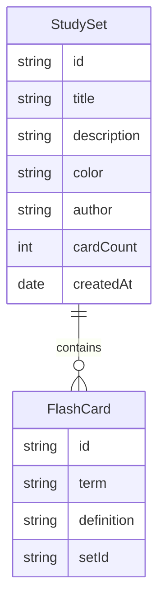

## 1. 架构设计

```mermaid
flowchart TD
    "用户浏览器" --> "React 前端应用"
    "React 前端应用" --> "组件层"
    "组件层" --> "状态管理层"
    "组件层" --> "路由层"
    "状态管理层" --> "本地存储/LocalStorage"
```

## 2. 技术选型

- **前端框架**: React 18 + Vite
- **样式方案**: 纯 CSS（CSS 变量 + CSS Modules 风格）
- **路由**: React Router v6
- **状态管理**: React Context + useReducer
- **数据持久化**: LocalStorage（模拟数据，无需后端）
- **字体**: Google Fonts - Poppins + Noto Sans SC
- **包管理**: npm

## 3. 路由定义

| 路由 | 页面 | 说明 |
|------|------|------|
| / | 首页 | 推荐学习集、最近学习、快捷操作 |
| /set/:id | 学习集详情 | 查看学习集中的单词卡 |
| /set/:id/study | 闪卡学习模式 | 翻转卡片学习 |
| /set/:id/match | 匹配游戏 | 配对单词和定义 |
| /create | 创建学习集 | 新建单词卡集合 |
| /profile | 个人中心 | 用户的学习集和进度 |

## 4. 数据模型

### 4.1 数据模型定义



### 4.2 示例数据

```javascript
// 学习集
{
  id: "set-1",
  title: "GRE 核心词汇",
  description: "GRE考试中最常出现的300个高频词汇",
  color: "#4255FF",
  author: "英语学习达人",
  cardCount: 20,
  cards: [
    { id: "c1", term: "Aberration", definition: "偏差，失常" },
    { id: "c2", term: "Benevolent", definition: "仁慈的，善意的" }
  ],
  createdAt: "2026-05-01"
}
```

## 5. 项目结构

```
src/
├── App.jsx              # 根组件，路由配置
├── main.jsx            # 入口文件
├── index.css           # 全局样式 + CSS变量
├── components/
│   ├── Navbar.jsx      # 顶部导航栏
│   ├── StudySetCard.jsx # 学习集卡片组件
│   ├── FlashCard.jsx   # 闪卡翻转组件
│   └── StudyProgress.jsx # 学习进度组件
├── pages/
│   ├── HomePage.jsx    # 首页
│   ├── StudySetPage.jsx # 学习集详情页
│   ├── StudyMode.jsx   # 闪卡学习模式
│   ├── MatchGame.jsx   # 匹配游戏
│   ├── CreateSet.jsx   # 创建学习集
│   └── ProfilePage.jsx # 个人中心
├── context/
│   └── AppContext.jsx  # 全局状态管理
└── data/
    └── mockData.js     # 模拟数据
```
